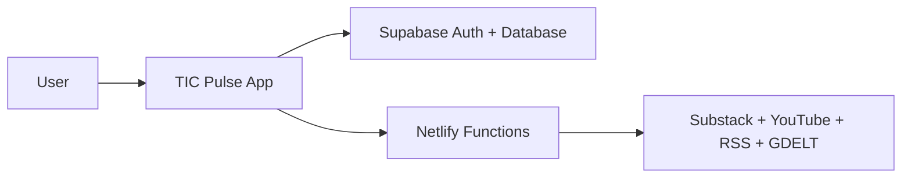
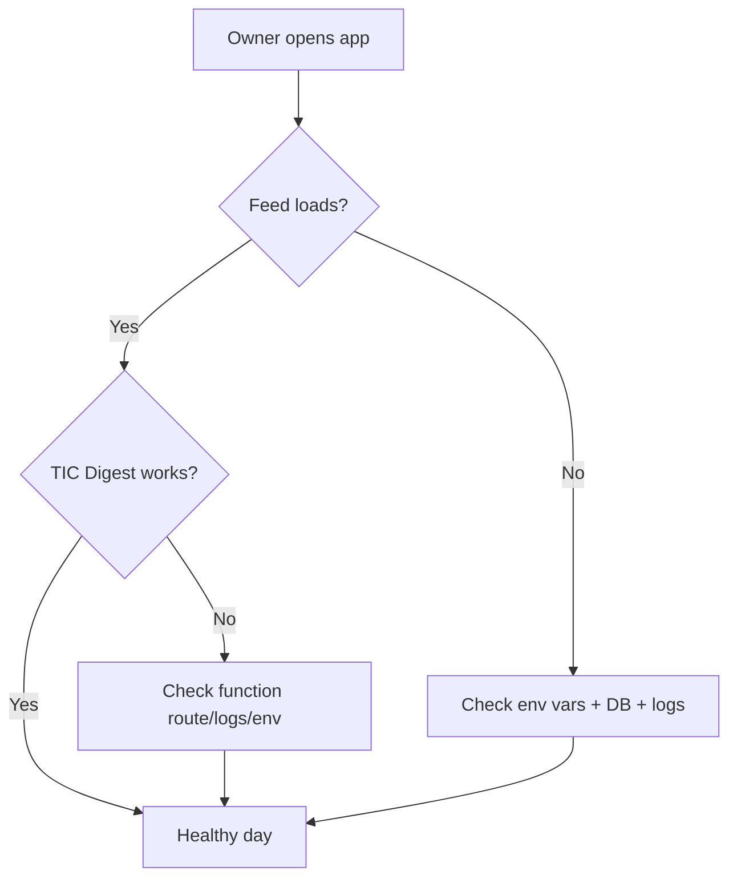

# TIC Digest Recovery + README/Handoff Plan

## Goal
Restore TIC Digest reliability, document the refactor in beginner-friendly language, and transfer ownership safely without losing project history.

## 1) Investigate and fix TIC Digest error

### Root-cause strategy
- **Primary hypothesis (highest confidence):** the TIC tab fetches `/.netlify/functions/fetch-substack` from frontend code, but local dev commonly runs via Vite (`npm run dev`) where that route is not served, causing HTML/404 responses. Current UI tries `res.json()` immediately and falls into generic error text.
- **Files to target:**
  - [C:/Users/remyg/Projects/Toby News/tic-pulse-main/tic-pulse-main/src/App.tsx](C:/Users/remyg/Projects/Toby News/tic-pulse-main/tic-pulse-main/src/App.tsx)
  - [C:/Users/remyg/Projects/Toby News/tic-pulse-main/tic-pulse-main/vite.config.ts](C:/Users/remyg/Projects/Toby News/tic-pulse-main/tic-pulse-main/vite.config.ts)
  - [C:/Users/remyg/Projects/Toby News/tic-pulse-main/tic-pulse-main/netlify/functions/fetch-substack.mjs](C:/Users/remyg/Projects/Toby News/tic-pulse-main/tic-pulse-main/netlify/functions/fetch-substack.mjs)

### Planned fix steps
- Update `DiscoverView` fetch handling to:
  - check `response.ok` before JSON parsing,
  - gracefully handle non-JSON payloads,
  - map distinct failure modes to specific user messages (offline vs endpoint missing vs server error).
- Add local-runtime compatibility:
  - either document `netlify dev` as required for TIC Digest testing,
  - or add a Vite proxy path for `/.netlify/functions/*` in local development.
- Keep function response shape stable (`{ ok, articles, count, error }`) and improve frontend guards.

### Verification
- Manual: open TIC tab locally and confirm articles render.
- Negative tests: force 404/500/non-JSON and confirm precise UI error.
- Confirm no regressions in Feed/Watch/Listen tabs.

## 2) README overhaul for non-technical readers

### Target file
- [C:/Users/remyg/Projects/Toby News/tic-pulse-main/tic-pulse-main/README.md](C:/Users/remyg/Projects/Toby News/tic-pulse-main/tic-pulse-main/README.md)

### Proposed structure
- **What this app does (plain English)**
- **What changed in the refactor**
  - what was done,
  - why this is better,
  - positive outcomes (stability, clarity, safer releases, easier onboarding).
- **Admin features and how to use them**
  - automated checks (`typecheck`, unit tests, Playwright e2e smoke),
  - release checklist workflow,
  - where to find logs and what to check first when something breaks.
- **Cost estimate: before vs now**
  - clear assumptions section,
  - side-by-side monthly estimate model (compute/API/storage + variability),
  - plain-language interpretation (best/typical/worst case).
- **Quick operations guide**
  - daily/weekly checks,
  - “if X breaks, do Y first”.
- **TIC Anthem section**
  - add a visible “Play the TIC Anthem” call-to-action linking to [C:/Users/remyg/Projects/Toby News/tic-pulse-main/tic-pulse-main/public/TIC-Anthem/Talent Intelligence_ A National Anthem.mp3](C:/Users/remyg/Projects/Toby News/tic-pulse-main/tic-pulse-main/public/TIC-Anthem/Talent Intelligence_ A National Anthem.mp3)
  - include an embedded HTML `<audio controls>` fallback where markdown viewers permit it, plus note that some viewers disable autoplay.

### Mermaid visualizations to include

## 3) Transfer this refactored app back to your friend

### Recommended strategy (better than scrape/reupload)
- Keep git history intact and transfer through GitHub workflow:
  - push this refactored state as a branch,
  - open a PR to the original repo,
  - review and merge with commit history preserved,
  - tag release and hand over runbook links.

### Why this is better
- Preserves provenance and rollback capability.
- Avoids missing hidden config/files that often happen in manual scraping uploads.
- Keeps CI/checks and discussion traceable.

### Handoff checklist
- Rotate secrets before and after handoff.
- Ensure `.env` not committed and `.gitignore` covers local/build artifacts.
- Validate CI passes and smoke tests pass post-merge.
- Share one-page owner instructions from README.

## Delivery order
1. Apply TIC Digest reliability fix and verify locally.
2. Rewrite README with beginner-first language + Mermaid + admin/testing + cost section + anthem play option.
3. Prepare friend-transfer runbook and recommended PR-based integration steps.
